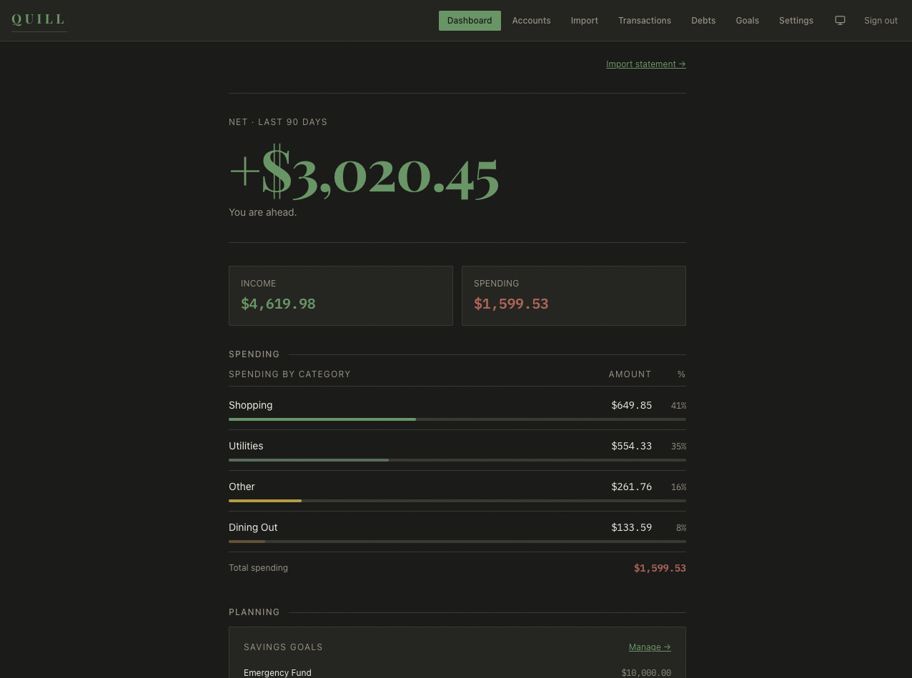
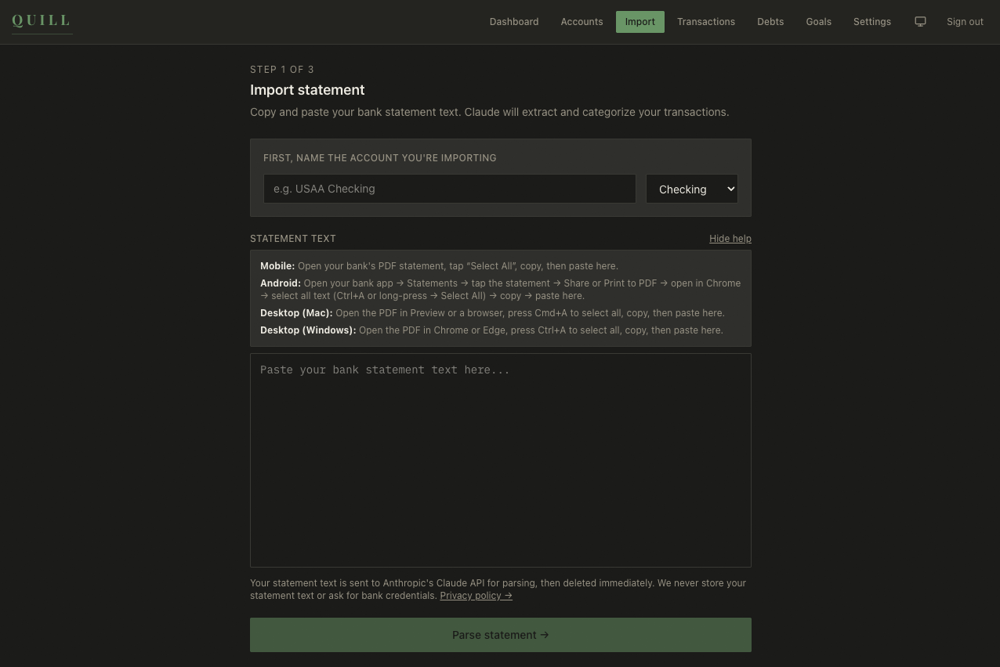
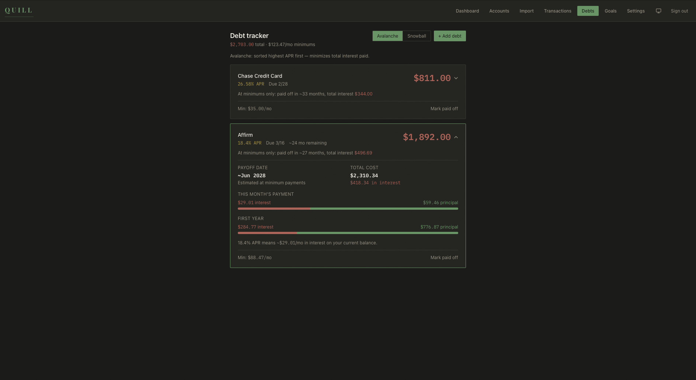
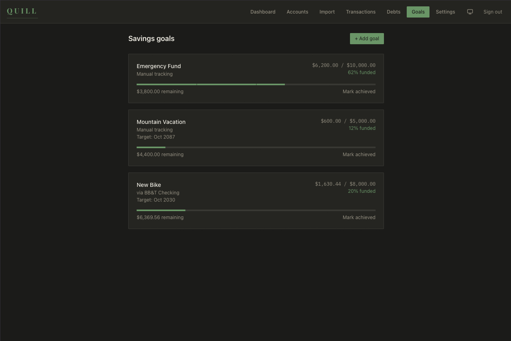

# OpenQuill

**Your personal cashbook.**

> Paste your bank statement. No Plaid. No passwords. No credentials.

OpenQuill is an open-source personal finance tool for people who want full visibility into their money without handing their bank login to a third-party aggregator.

Copy your bank statement. Paste it. Claude parses and categorizes every transaction. See your full picture.

<p align="center">
  
</p>

---

## Why OpenQuill?

Most personal finance apps ask for your bank login. Your credentials pass through Plaid or a similar aggregator, a third party that gets breached, sells behavioral data, or shuts down and takes your history with it.

OpenQuill doesn't connect to your bank. You copy your statement text, paste it, and OpenQuill reads it. No credentials leave your hands. No persistent connection. No intermediary with the keys to your account.

The question isn't whether we *can* build a bank-connected finance app. The question is whether the world needs another one. We think it doesn't.

---

## What It Does

<p align="center">
  
</p>

- **Statement import.** Paste bank statement text from your PDF viewer or bank website. Claude parses and categorizes every transaction automatically.
- **Dashboard.** Net position (income minus spending), spending by category, debt summary, savings progress. All at a glance.
- **Debt tracker.** Interest projections, payoff timelines, principal vs. interest breakdowns, avalanche vs. snowball ordering. Click any debt to see the full picture.
- **Savings goals.** Track progress toward goals, link to accounts or track manually, see projected completion dates.
- **Affordability calculator.** "Can I afford this?" with an honest, direct answer based on your actual numbers.
- **Magic link auth.** No passwords. Enter your email, click the link, you're in.

<p align="center">
  
</p>

<p align="center">
  
</p>

---

## What It Doesn't Do

Some of these are principled decisions. Some are v2.

- **Real-time bank sync.** By design. That would require your credentials.
- **PDF upload.** Parsing logic exists; file upload deferred to v2.
- **Bill pay / scheduled payments.** Out of scope.
- **Investment or brokerage tracking.** Out of scope for v1.
- **Pro tier / Stripe billing.** Architecture in place, launching in v2.

---

## Your Data, Your Database

*This section was reviewed by our security lead. His position: "Privacy isn't a feature. It's the absence of something bad that happens to people when you don't take it seriously."*

OpenQuill is designed around a simple principle: your financial data is yours. Here's how the architecture reflects that.

**What the system does:**

- **Row-level security on every table.** Your data is isolated at the database level, not the application layer, the *database* layer. Even if the application code had a bug, PostgreSQL's RLS policies prevent one user from reading another's data.
- **Statement text is processed ephemerally.** When you paste a statement, it's sent to Anthropic's Claude API over HTTPS for parsing. After parsing, the raw text is discarded. It is not written to our database. Anthropic's API does not use API inputs for model training.
- **No bank credentials, ever.** OpenQuill has no mechanism to connect to your bank. There is no integration, no OAuth flow, no stored credentials. The architecture doesn't support it because it was never built.
- **No tracking.** No Google Analytics. No behavioral tracking. No ad pixels. No cookies beyond the session cookie that keeps you logged in.
- **Magic link authentication.** No passwords are stored because there are no passwords. You authenticate via a one-time link sent to your email.
- **Security headers on every response.** Content Security Policy, HSTS, X-Frame-Options, X-Content-Type-Options, all configured at the framework level.
- **Account deletion cascades.** When you delete your account, your data is purged. There is no "we'll keep it for 90 days in case you change your mind." It's gone.

**What we don't do:**

- We don't sell data.
- We don't share data with third parties (beyond the ephemeral statement parsing described above).
- We don't build behavioral profiles.
- We don't run A/B tests on your financial anxiety.

Read the full [Privacy Policy](https://openquill.vercel.app/privacy). Plain English, not legalese.

---

## Tech Stack

| Layer | Technology |
|-------|-----------|
| Frontend | Next.js 16 (App Router), React 19, TypeScript, Tailwind CSS 4 |
| Components | shadcn/ui (Radix primitives) |
| Backend | Next.js API routes |
| Database | PostgreSQL via Supabase (RLS on every table) |
| Auth | Supabase magic link |
| AI parsing | Anthropic Claude (Haiku) |
| Validation | Zod |
| Hosting | Vercel + Supabase |
| Monitoring | Sentry (error tracking only, no financial data sent) |

---

## Getting Started

### 1. Clone and install

```bash
git clone https://github.com/Jamflynt/openquill
cd openquill
npm install
```

### 2. Set up Supabase

1. Create a project at [supabase.com](https://supabase.com)
2. In the SQL Editor, run the migrations in order:
   - `supabase/migrations/001_initial_schema.sql`
   - `supabase/migrations/002_security_fixes.sql`
   - Through `006_goals_current_amount.sql`
3. Copy your project URL, anon key, and service role key

### 3. Configure environment

```bash
cp .env.local.example .env.local
```

Fill in your Supabase and Anthropic credentials. See `.env.local.example` for the full list.

### 4. Run locally

```bash
npm run dev
```

Open [http://localhost:3000](http://localhost:3000).

### 5. (Optional) Seed demo data

After logging in, copy your user UUID from the Supabase Auth dashboard and run `supabase/seed.sql` in the SQL Editor.

---

## Testing

```bash
# Unit tests (89 tests, fast, offline)
npm test

# E2E tests (requires dev server + real Supabase)
npm run test:e2e

# Everything
npm run test:all
```

---

## Deployment

1. Push to GitHub
2. Connect the repo to [Vercel](https://vercel.com). Next.js is detected automatically
3. Add environment variables in the Vercel dashboard
4. Deploy
5. Update Supabase Auth redirect URLs for your production domain

---

## Support This Project

OpenQuill is free and open source. If it's useful to you, you can support development on Ko-fi.

Set `NEXT_PUBLIC_KOFI_URL` in your environment to enable the in-app support link.

---

## License

MIT. See [LICENSE](LICENSE).
